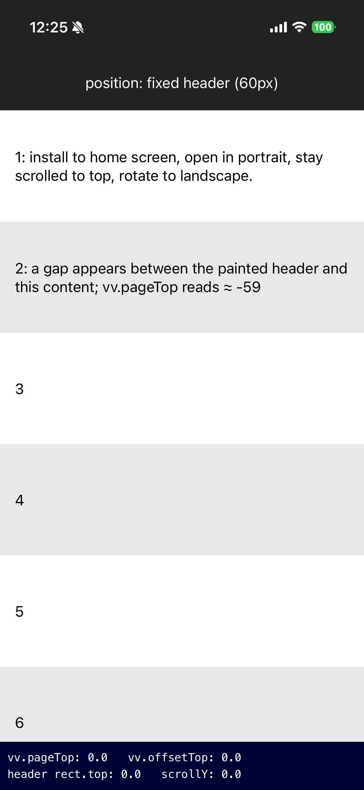
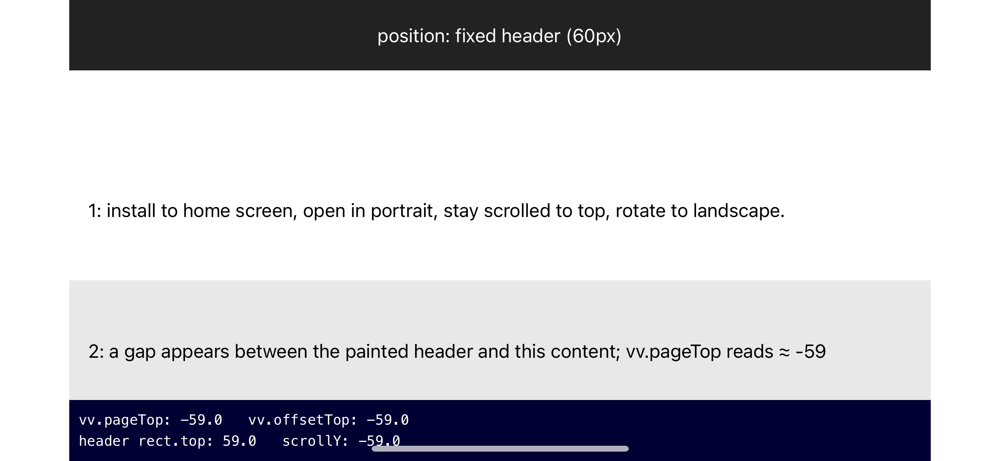

# pwa-viewport-repro

A minimal reproduction of a bug in iPhone PWAs, where rotation causes viewport
values to desync, creating a visual gap.

### Before reproduction

Opened in portrait, scrolled to top.

### After rotating to landscape

